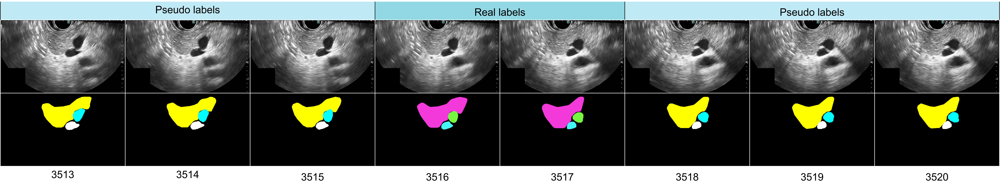

# McEUS: Multi-class Endoscopic UltraSound Dataset & Pseudo-Labeling Pipeline

This repository contains the official dataset samples and source code for our submission to a journal of medical imaging: **"McEUS: A Multi-Class Endoscopic Ultrasound Dataset and Weakly Supervised Segmentation Pipeline via Flow-Guided and Multi-Detector SAM2 Pseudo-Labeling"**.

To facilitate reproducibility and support the Surgical Data Science community, we release our multi-class Endoscopic Ultrasound (McEUS) dataset alongside our pseudo-label expansion frameworks.

---

## 📂 Dataset Description [Coming soon upon paper acceptance...]

The McEUS dataset consists of two highly complementary components collected under identical standardized clinical protocols using Olympus EU-ME2 devices. To prevent data leakage, patient-level splits are strictly enforced.

### 1. `Data_internal/` (Part A: Fully/Weakly-Supervised Benchmark & Testing)
* **Demographics:** 9 patients, resulting in 9 distinct scans.
* **Role:** Serves as the internal dataset containing expert-verified manual ground-truth annotations. **All quantitative validation and final testing strictly occur on this internal subset.**
* **Contents:** Includes original raw frames, manual ground-truth masks, and propagated pseudo-labels generated via our optical flow pipeline.

### 2. `Data_external/` (Part B: Pseudo-Label Expansion on Unseen Data)
* **Demographics:** 18 patients, comprising 18 individual scans.
* **Role:** Serves as a large-scale, unannotated external clinical cohort. Because it lacks manual ground truth, it is utilized exclusively to demonstrate performance gains via joint training and pre-training benchmarks.
* **Contents:** Contains unannotated clinical frames and highly reliable external pseudo-labels generated via our multi-detector prompting and confidence-weighted fusion strategy.

## 📊 Dataset Overview & Specifications

The McEUS dataset consists of two distinct components designed for different stages of weakly supervised pipeline evaluation. Both datasets were acquired under standardized clinical protocols using Olympus EU-ME2 devices.

### Table 1: Fundamental Characteristics of Parts A and B

| Feature | Part A (Internal Dataset) | Part B (External Dataset) |
| :--- | :--- | :--- |
| **Primary Description** | Internal benchmark with ground truth | Unannotated external clinical cohort |
| **Patients Involved** | 9 Patients | 18 Patients |
| **EUS Video Scans** | 9 Distinct Videos | 18 Distinct Videos |
| **Collection Period** | Mar 2023 – Jan 2025 | Feb 2025 – Jul 2025 |
| **Label Acquisition** | Manual annotations + Flow-guided pseudo-labels | Multi-detector SAM2 pseudo-labels |
| **Primary Usage** | Training, Validation, and Final Testing | Pre-training and Joint training benchmarks |
| **Evaluation Splits** | Intra-patient: 6-fold cross-validation<br>Inter-patient: Leave-one-out validation | No splits enforced (Training subsets only) |

---

### Table 2: Composition of Supervision in Part A (Internal Dataset)

To construct highly reliable supervision while minimizing labeling costs, Part A undergoes a rigorous two-stage label acquisition pipeline combining sparse manual annotation with dense temporal propagation.

| Supervision Type | Frame Count | Acquisition & Propagation Methodology | Usage in Pipeline |
| :--- | :---: | :--- | :--- |
| **Real Labels** *(Manual Ground Truth)* | **1,843** | Extracted at 1 FPS followed by Key Frame Selection via **Local-Optimal Optical Flow**, finalized with expert manual annotation. | Training, Validation, and **Testing** |
| **Internal Pseudo-Labels** *(Flow Propagated)* | **5,231** | Generated by projecting real labels onto adjacent unannotated frames utilizing **IPOF** (Interpolated) and **DPOF** (Direct) Optical Flow. | Training only |

Samples of internal pseudo labels and related real labels for reference:

---
## 🚀 Core Pipelines & Code Structure

### 1. Internal Label Propagation (`generate_internal_pseudo_labels.py`)
Propagates sparse expert annotations across temporal video sequences utilizing our dense optical flow estimation method, expanding internal supervision with minimal manual cost.

### 2. External Pseudo-Label Generation (`cluster_weighted_fusion.py`)
Generates high-quality pseudo-labels for the completely unannotated external dataset. It leverages multi-detector geometric behaviors (e.g., Union/Intersection bounding box paradigms) combined with a robust clustering and confidence-weighted fusion framework.

---

## 🛠️ Getting Started

### 1. Environment Setup
Clone the repository and install the required dependencies:
```bash
git clone https://github.com/mqxwd68/McEUS.git && cd McEUS
pip install -r requirements.txt
```
---
### 2. Pipeline I: Internal Pseudo-Label Generation (Part A)
This pipeline propagates sparse expert manual annotations (YOLO format) to adjacent unannotated video frames utilizing our proximity-routed optical flow algorithm.
```bash
python generate_internal_pseudo_labels.py --data_root Data_internal --t1 5 --t2 10
```
* **Parameters:**
  * `--t1` : Maximum frame interval allowing bi-directional Interpolated Projection Optical Flow (IPOF).
  * `--t2` : Maximum permissible distance for unidirectional Direct Projection Optical Flow (DPOF).

* **Outputs:** Propagated YOLO texts will be saved in `Data_internal/target/{P}/masks_pseudo_yolo/` and visually mapped semantic palettes in `Data_internal/target/{P}/masks_pseudo/`.
---
### 3. Pipeline II: External Zero-Cost Expansion (Part B)

For entirely unannotated clinical cohorts, we utilize a multi-detector ensemble prompting strategy coupled with SAM2. This is a two-step process.

#### Step 3.1: Download Pre-Trained Weights

To ensure long-term reproducibility and zero-quota limits, our YOLO cross-validation ensemble models and SAM2 weights are permanently hosted on **Zenodo**. Download and extract them automatically using our utility script:

```bash
python download_weights.py
```
#### Step 3.2: Execute Multi-Detector Fusion Pipeline

Once the weights are prepared, execute the prompt generation and SAM2 segmentation pipeline on your external data:

```bash
python cluster_weighted_fusion.py --data_root Data_external --method weighted_fusion --iou_thresh 0.5
```
* **Parameters:**

  * `--method` : Aggregation strategy for overlapping prompts (Choices: `nms`, `weighted_fusion`, `intersection`, `union`, etc.). We highly recommend `weighted_fusion` for optimal precision and sub-pixel edge fidelity.

  * `--folds` : Identifies which YOLO ensemble detectors to activate (Defaults to `1 2 3 4 5 6`).

* **Outputs:** Generated annotations will be exported directly to `Data_external/{P}/masks_pseudo_yolo/` and `Data_external/{P}/masks_pseudo/`.
